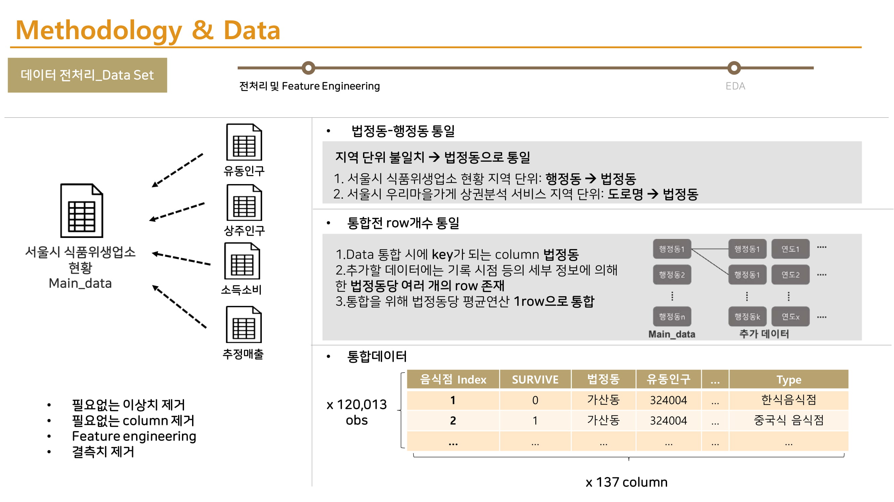

# 서울시 데이터 기반 일반음식점 최적 위치/업종/전략 추천

#### -- Project Status: Completed

## Project Intro/Objective
특정 위치/업종 일반음식점의 2년 생존 확률을 예측하고, 해당 위치/업종 일반음식점 생존률/배달 리뷰 시각화 자료를 출력해주는 프로젝트입니다. 창업 예정자에게 일반음식점 최적 위치/업종/전략을 추천하는 것을 목표로 합니다.

### Methods Used
* Textmining
  * Tokenizing
  * Count Vector 
* Machine Learning Algorithms
  * Logistic Regression
  * Random Forest
  * MLP
  * Bagging
* Data Visualization
  * Map Visualization
  * Wordcloud

### Technologies
* Python
* etc. 

## Project Description

### Project Workflow Overview

### Data / Data Preprocessing

### 2년 생존 예측 모델

Logistic Regression : 

Random Forest Classifier : 

MLP/Bagging: 

- Random Forest Classifier 선택. F1-score: 0.77

### Textmining

- 크롤링된 배달 리뷰를 이용하여 CountVector 생성
- WordCloud & 지도 시각화 생성

### Result

